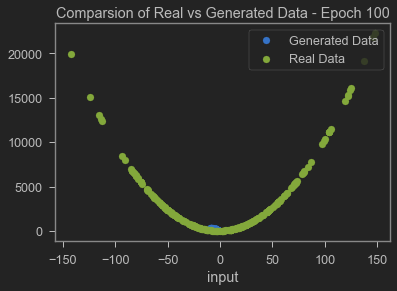
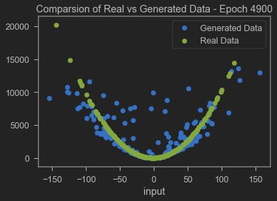
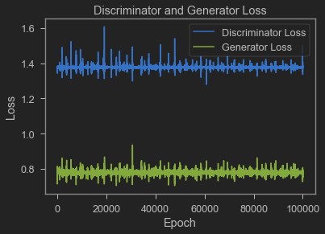

# Implementation of GANs using PyTorch

The Generative Adversarial Network implemented in this project was based on the original paper [Generative Adversarial Networks](https://arxiv.org/abs/1406.2661) by Goodfellow et al.

It was trained to learn a simple polynomial function 


ReLU and Leaky ReLU with Dropout were used in the generator and discriminator respectively along with having one-sided label smoothing. 

These optimisations were based on the recommendations from [Improved Techniques for Training GANs](https://arxiv.org/pdf/1606.03498.pdf) and [Unsupervised Representation Learning with Deep Convolutional Generative Adversarial Networks](https://arxiv.org/pdf/1511.06434.pdf).

**To run this project**
```
pip install -r requirements.txt
python GAN.py
```

### Output of the Network before and after training
 
### Graph of the losses of the Generator and Discriminator

